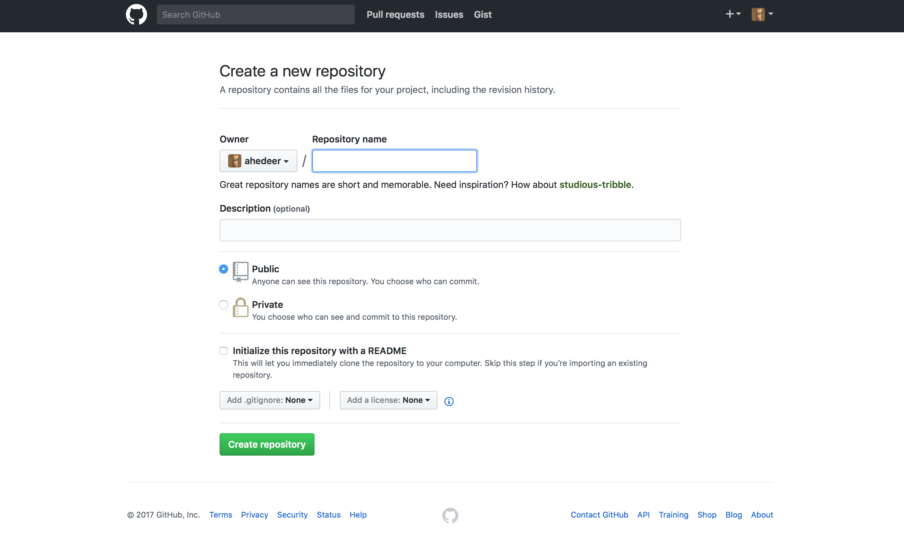
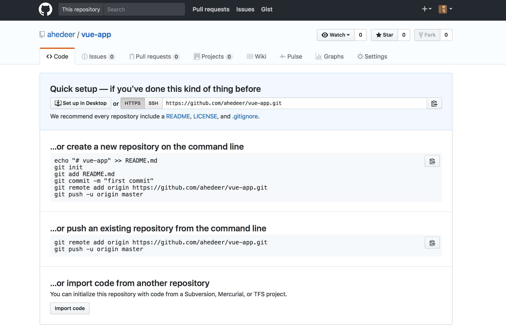
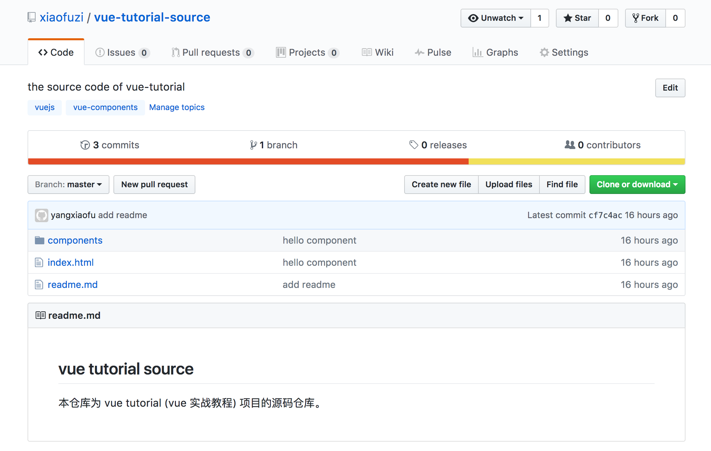
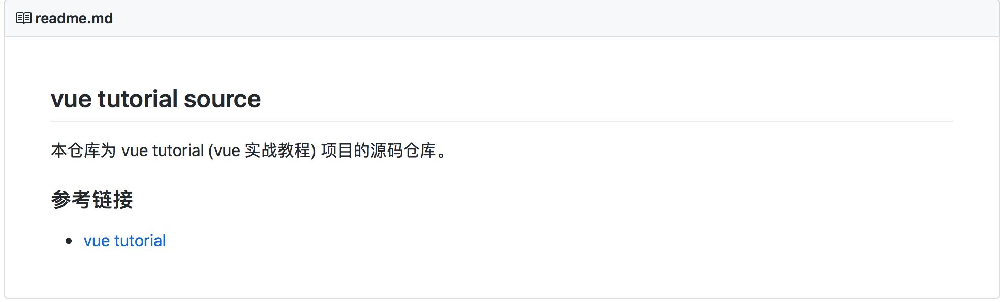
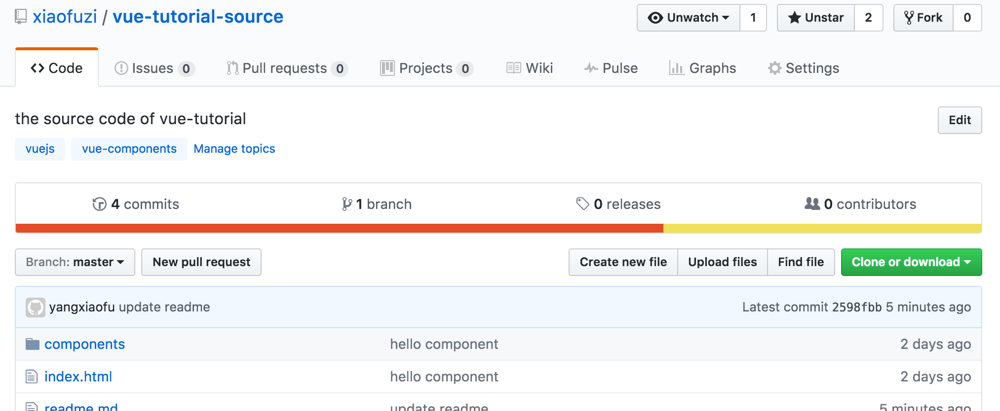
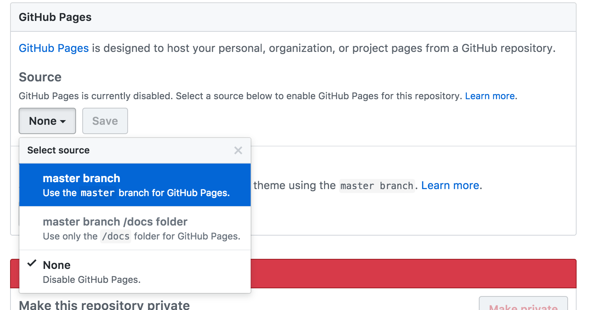
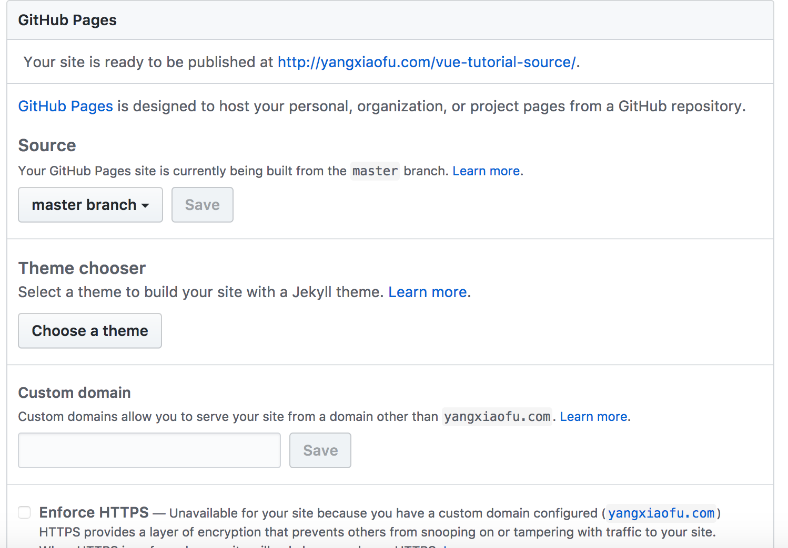
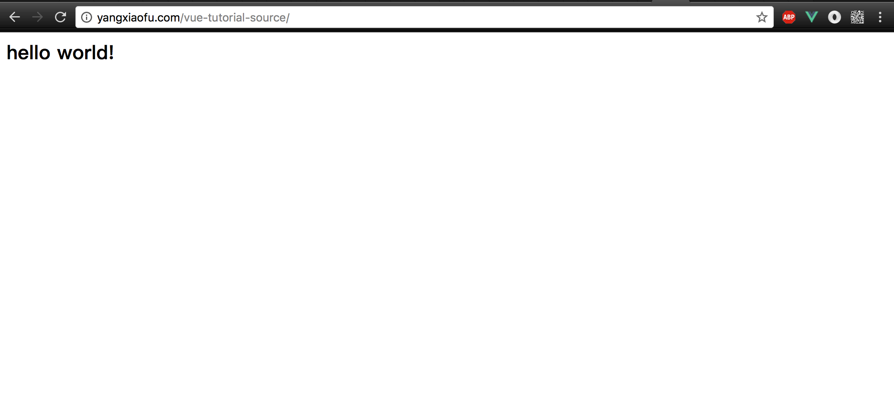

# 第一章 从零开始，完成一次发布

本书会向你详细的介绍使用 vue.js 开发 web 应用的方方面面，包括 html、css、less、vue、vuex、版本控制、github的使用等知识。学会这些知识将帮助你胜任 Vue 相关的开发工作，同时成为一名更好的 web 开发工程师。阅读本书能让你快速学会 vue 框架的基础，包括组件的编写、指令的开发、vue-router、vuex 的使用。读完本书之后，你已经可以独立搭建 vue 技术栈项目、编写自己的组件库、深入了解 vue 背后的知识。

> 脚手架: 更快、更简单、更诱人

Vue 以其小而美，易上手的特性，一推出就得到了众多开发者的喜爱。借助于 `vue-cli` 工具，我们更是可以在几分钟之内就搭建好一个完善的单页面应用框架，极大的提升开发的效率。
使用脚手架能够帮助我们快速、简单的开发应用，但是是使用脚手架生成的代码对于初学者来说过于复杂，虽然能学会使用脚手架进行开发，但是并不明白整个构建流程。所以本书会从零开始，带着你一步一步的开发一个类似于微博的应用程序，通过这个过程，让你能对 vue 有一个较为深刻的认识和理解，而且能灵活运用，开发任务其它类型的应用。

## 1.1 简介

Vue.js（读音 /vjuː/，类似于 view） 是一套构建用户界面的渐进式框架。与其他重量级框架不同的是，Vue 采用自底向上增量开发的设计。Vue 的核心库只关注视图层，它不仅易于上手，还便于与第三方库或既有项目整合。另一方面，当与单文件组件和 Vue 生态系统支持的库结合使用时，Vue 也完全能够为复杂的单页应用程序提供驱动。

### 预备知识

本书不仅介绍 Vue.js，还会涉及到路由、状态管理、构建工具、ajax等。所以在阅读本书之前建议先了解一些 web 编程的基础知识。如果你刚开始接触软件开发，建议你先了解编程方面的基础知识。

* 编程基础知识
	* [Learn Enough Command Line to Be Dangerous](http://www.learnenough.com/command-line-tutorial)
	* [Learn Enough Text Editor to Be Dangerous](http://www.learnenough.com/text-editor-tutorial)
	* [git 版本控制](http://www.liaoxuefeng.com/wiki/0013739516305929606dd18361248578c67b8067c8c017b000/)

* web 基础知识
	* [HTML/CSS](http://www.w3school.com.cn/h.asp)
	* [Javascript](http://www.liaoxuefeng.com/wiki/001434446689867b27157e896e74d51a89c25cc8b43bdb3000)
	* [ES6](http://es6.ruanyifeng.com)
	* [ajax](http://www.w3school.com.cn/ajax/ajax_intro.asp)

### 练习
书中有大量的练习，建议你在阅读的过程中做这些练习。

为了避免影响后续章节的学习，习题通常是章节独立的，只有少部分是会在后续的学习中用到，此时会给出解答说明。

练习都具有一定的难度，我们先从几个简单的开始：

1. vue 目前的版本号是多少？
2. 截止到目前，vue 在 github 上的 star 个数是多少？
3. 截止到目前，vue 被下载的次数?

<hr>

## 1.2 环境搭建

不同的操作系统、编辑器、集成开发环境、版本会导致开发环境的多样性，即使对于有经验的开发者来说，也会几经波折，所以如果你遇到什么问题可以给我们留言。本书中，我们将会使用 Mac 作为本次的开发硬件，如果你使用的是 windows 的电脑，也不用担心，安装对应的系统版本软件就可以。除此之外，如果你觉得搭建环境过于繁琐，可以使用云开发环境，这样可以免去不少麻烦。

云端集成开发环境推荐：

* [cloud9](https://c9.io/)
* [jsfiddle](https://jsfiddle.net)

不同的人有不同的喜好，每个开发者都有自己的开发环境，为了避免问题的复杂化，本书在此将推荐一个比较通用的开发环境，当然你也可以保持自己的习惯。

本书采用的开发环境：

* [编辑器 - sublime text3](http://www.sublimetext.com/3)
* [Nodejs(v6.9.4)](http://nodejs.cn)
* [包管理 - npm(yarn)](https://docs.npmjs.com)
* [构建工具 - webpack2.2](https://webpack.js.org/concepts/)
* [版本控制 - git](http://www.liaoxuefeng.com/wiki/0013739516305929606dd18361248578c67b8067c8c017b000/)
* [源码托管 - github](www.github.com)
* [代码校验 - esLint](http://eslint.cn)

如果一开始你不想安装如此多的软件也是可以的，即时不安装我们也可以进行应用的开发。但随着后续章节的学习你最好搭建这样的一套开发环境，这将会帮助你更好的进行开发。

## 1.3 第一个 vue 应用

在计算机编程领域里，第一个应用一般都是编写一个 "hello world" 程序。在这里，我们将编写一个显示 `hello world` 的 vue 应用。

### 创建项目

首先创建一个项目目录并命名为 `vue-tutorial-source`，这里我们使用 Unix 命令来创建，如果你不熟悉可以手动创建。但是作为一名开发者，我建议你学会基本的 Unix 命令。

```bash
mkdir vue-tutorial-source	// 新建项目根目录
cd vue-tutorial-source 		// 进入根目录
```

> Unix 命令使用 windows 系统的用户可能需要查看对应的 windows 命令行教程。这里主要对 Unix 命令行 -- Bash 进行说明。
命令行的基本思想很简单: 使用简短的命令就可以做很多操作，例如创建目录(`mkdir`)，移动和复制文件 (`mv` 和 `cp`)，以及切换目录浏览文件。对于习惯了图形化界面的用户可能不习惯使用命令行，但是要了解，命令行是开发者强大的工具之一，经验丰富的开发者都比较熟悉以及更愿意使用命令行来工作。更有甚者，使用完全基于命令的编辑器，如 vim、emacs。命令行涉及很多的知识，但在本书中只使用了比较简单常用的一些命令，所以如果你不熟悉的话也不用担心。

### 一些常用的 Unix 命令
<table>
	<thead>
		<tr>
			<th>作用</th>
			<th>命令</th>
			<th>示例</th>
		</tr>
	</thead>
	<tbody>
		<tr>
			<td>列出当前目录下的文件</td>
			<td>ls</td>
			<td>ls -l</td>
		</tr>
		<tr>
			<td>新建目录</td>
			<td>`mkdir <dirname>`</td>
			<td>mkdir new-dir</td>
		</tr>
		<tr>
			<td>切换目录</td>
			<td>`cd <dirname>`</td>
			<td>ls -l</td>
		</tr>
		<tr>
			<td>进入上级目录</td>
			<td></td>
			<td>cd ..</td>
		</tr>
		<tr>
			<td>删除文件</td>
			<td>`rm <file>`</td>
			<td>rm foo</td>
		</tr>
	</tbody>
</table>

接下来创建 `components` 目录存放组件文件，并在 `components`目录下创建 `helloWorld.js` 文件，同时创建 `index.html` 文件作为我们应用的入口。

命令行操作

```base
touch index.html
mkdir components
cd components
touch helloWorld.js
```
如果你不习惯命令行，使用图形界面来创建也是一样的。


### 引入 Vue.js

创建好目录结构后，就可以正式开发编码了，在开始之前，我们需要注意如下问题：

* vue 的版本
	软件都是有版本的概念的，不同的版本功能会有不同，大的版本还会有兼容性问题，所以我们要确定好使用的版本。本书我们使用 vue 2.2 版本作为实例讲解。
* vue 的引入方式
	这里我们先简单的通过 CDN 的方式引入 vue.js，后续我们会通过 npm 包管理工具以模块的方式引入 vue。
* 编码规范问题
	无论对于初学者或是有经验的开发者，编码规范都是很有必要且很有帮助的。这里我们参考 [vue 组件编码规范](https://github.com/pablohpsilva/vuejs-component-style-guide/blob/master/README-CN.md#目录)。

在 `index.html`文件中引入 vue，如下所示：

```
<script src="http://cdn.bootcss.com/vue/2.2.2/vue.min.js"></script>
```

第一个应用源码：
```html
<!DOCTYPE>
<html>
<head>
	<title>hello world</title>
</head>
<body>
	<div id="app"></div>
	<script src="http://cdn.bootcss.com/vue/2.2.2/vue.min.js"></script>
	<script type="text/javascript">
		new Vue({
			el: '#app',
			data: {
				text: 'hello world!'
			},
			render (h) {
				return h('h2', this.text);
			}
		})
	</script>
</body>
</html>
```

就这样，一个简单的 vue 应用就完成了，这里会在界面上显示一个二级标题的 `hello world!` 在 id 为 app 的 div 中。

下面我们来看看他是如何工作的，vue 应用通过 `new Vue()` 的方式来创建，并绑定到页面上的一个元素，这里是 id 为 app 的 div 标签。然后通过 render 函数返回渲染结果并渲染到页面上。`this.text` 可以直接去到 data 对象中的 text 属性，同时 data 中的属性还会具备响应式的特性，稍后我们在讲解这个特性。除了通过 render 函数渲染之外，还可以通过模板的形式来渲染页面。如下所示，也可以得到同样的渲染结果。

```html
<!DOCTYPE>
<html>
<head>
	<title>hello world</title>
</head>
<body>
	<div id="app">
		<h2>{{text}}</h2>
	</div>
	<script src="http://cdn.bootcss.com/vue/2.2.2/vue.min.js"></script>
	<script type="text/javascript">
		new Vue({
			el: '#app',
			data: {
				text: 'hello world!'
			}
		})
	</script>
</body>
</html>
```
模板的方式与 html 语法更为接近，布局也更为简洁，模板也是大多数人的选择，但 render 有更为灵活的语法，所以如果你也习惯 render 的方式的话大可以放心的用。

### hello-world 组件的编写

这里我们通过 vue 的 component 方法注册一个全局的组件。需要注意的是：

* 组件的 data 对象通过一个函数返回，这样组件才能够实现组件复用
* 命名，组件命名以驼峰或是横杠的方式，但在模板中引用的时候必须是横杠(驼峰对应相应的横杠形式)，这是 html 语法自身的限制，在 html 中，标签是不区分大小写的

```js
// 定义名为 hello-world 的新组件
Vue.component('hello-world', {
  template: '<h2>{{text}}</h2>',
  data: function () {
  	return {
  		text: 'hello world!'
  	}
  }
})
```

如何引用？

```html
<!DOCTYPE>
<html>
<head>
	<title>hello world</title>
</head>
<body>
	<div id="app">
		<hello-world></hello-world>
	</div>
	<script src="http://cdn.bootcss.com/vue/2.2.2/vue.min.js"></script>
	<script type="text/javascript" src='./components/helloWorld.js'></script>
	<script type="text/javascript">
		new Vue({
			el: '#app'
		})
	</script>
</body>
</html>
```

### 练习
> 学会解决一个自己不会的问题是一个开发者的基本要求 

1. 如何确认当前引入的 vue 的版本？
2. 了解 vue 全局组件和局部组件有什么不同？
3. 把 显示的 `hello world` 更改成 `how do you do?`
4. 安装 git、nodeJS、npm？

<hr>

## 1.4 版本控制之 Git

现在我们已经创建了一个简单的 vue 应用，接下来就将源码纳入版本控制系统，虽然说版本控制并不是必须的，但对于有经验的开发者来说，这都是基本的事情，所以如果你是初学者的话，现在就应该开始学习使用版本控制系统来管理你的源码。版本控制系统可以跟踪项目中代码的变化，便于与他人协作，如果出现了问题(如不小心删除了重要的源码)，还可以回滚到以前的版本。
版本控制系统种类很多，在 web 社区基本都使用 Git，大名鼎鼎的 [github](www.github.com) 就是基于 git 而来的。有部分公司使用 SVN。在这里我们使用 Git 作为版本控制工具，Git 是一个分布式版本控制系统，由 Linus Torvalds 开发，最初的目的是用来管理 Linux 内核源码。本书会介绍一些基础的 git 知识，如果想更深入的了解，可以查看[官方指南](https://git-scm.com/doc)。

### 如何安装

参考：[官方安装指南](https://git-scm.com/book/zh/v1/起步-安装-Git)

### git 设置

用户名和邮箱设置，用户名和邮箱会在公开的仓库中显示，如 github 这样的代码托管平台，是通过用户名和邮箱来追踪开发者的。

```
$ git config --global user.name "Your Name"
$ git config --global user.email your.email@example.com
```

如上的设置会对整个系统有效，即建立的所以仓库都被覆盖到，如果想设置特定的仓库，可单独设置，如下：

```
$ git config user.name "Your Name"
$ git config user.email your.email@example.com
```

首先进入到当前仓库目录，然后执行如上命令。

### 如何使用 git

git 是以仓库为单位进行版本控制的，下面的步骤每次新建一个仓库(repository)时都要执行。首先进入项目的根目录，初始化一个新仓库:

* 初始化仓库
```
git init
```

* 添加文件到仓库中进行版本控制
```
git add .
```
说明，初始化仓库后，并不代表项目中的文件已经处于版本控制状态，只有加入版本控制的文件才会进行版本管理。如 `git add .` 就会将该目录下的所有文件加入版本管理。

* .gitignore 文件

在仓库的根目录创建该文件，通过该文件可以指定忽略相应的文件不进行版本管理，这是一个非常有用的文件，后续我们会进一步的使用。

* 提交文件

```
git commit -m '提交说明'
```

当将需要进行版本控制的文件加入版本控制系统后，我们还需要对每一次的改动进行提交，每一个提交都会对应一个版本，这样我们就不用担心因为不小心的改动造成无法还原的情况，因为每一个版本都已经记录了每一次的改动提交，我们可以回溯到相应的版本。

* 查看提交历史

```
git log
```

* 推送到远程仓库

```
git push
```

### GitHub

我们已经把项目纳入版本控制系统，接下来可以把代码推送到 [Github](www.github.com)。这是一个专门用来托管和分享 Git 仓库的网站。Vue.js 的源码就托管在 Github 上。在 Github 上托管一份 Git仓库的备份有两个目的: 其一，对代码做个完整的备份(包括所有的提交记录)；其二，便于多人协作开发。

> GitHub 、Bitbucket、gitlab
目前，最受欢迎的托管平台是 Github 和 Bitbucket。它们都可以托管仓库、协作开发、搜索和浏览仓库。不同之处是 Github 为开源项目提供无限量的免费仓库，但私有仓库收费；而 Bitbucket 提供了无限量的私有仓库，仅当协作者超过了一定数量时才收费。除此之外，最近还出现了另一个代码托管平台，gitlab，也是基于 git 版本控制系统的，而且公开仓库和私有仓库都不限量。开发者可以根据自己的需求自由选择。

Github 的使用方法很简单，但可能对于不熟悉的开发者来说使用还是需要花一定的成本，所以这里进行简单的介绍：

1. 如果还未注册 Github 账号，先注册一个 [Github 账号](https://github.com/join?source=header-repo)

2. 添加 SSH keys，这样可以通过 ssh 协议访问远程仓库,参考[官方教程](https://help.github.com/articles/connecting-to-github-with-ssh/)

完成上面两步后，就可以推送代码到远程仓库了。

### 建立远程仓库

点击右上角的 '+' 按钮，然后选择创建仓库即进入创建页面，如下图所示：



按要求填写信息即可。

创建好后会有相应的推送指南信息，如下:



推送指南分两部分，其一是未建立本地仓库，则按方式一处理。其二是已有本地仓库，则按方式二处理。执行对应的命令即可。

如下为本书示例代码的初始仓库推送到 github 的页面, 仓库地址: [https://github.com/xiaofuzi/vue-tutorial-source](https://github.com/xiaofuzi/vue-tutorial-source)。



> 注：记得给每一个仓库添加一个 `README.md` 文件，github 默认会显示该页面作为仓库的介绍信息，这也是其他开发者了解该仓库的最好方式。

### git 分支使用

* 分支
Git 分支(branch)的功能很强大，在多人协作中尤其有用。分支是对仓库的高效复制，在分支中所作的改动不会影响其它分支，这样多人开发时，每个人建立自己的分支，相互之间就不会影响。
我们可以通过 `checkout` 命令并指定 -b 标识创建一个新的分支，如下：

```
$ git checkout -b dev
Switched to a new branch 'dev'
$ git branch
  master
* dev
```

这里，我们首先通过 checkout 命令创建了一个 dev 分支，创建后会自动切换到新建立的分支。通过 git branch 命令可以查看当前的本地分支情况，星号 (*) 表示当前所在的分支。在多人协作的时候，分支就显得尤其重要，但即使只有一个开发者，将当前工作分支和主分支(master) 隔离开，这样在添加新的改动时就可以不用顾忌改动的大小，即使出错了，切换回主分支，然后删除当前改动分支即可。

> 对于比较少量的改动没必要建立新的分支，但当改动过大时，建立一个新的分支是一种很好的习惯。

* 编辑

我们已经创建好了新的分支，现在可以做一些改动。这里我们更新一下 `README.md` 文件，加上 `vue-tutorial` 仓库地址。

新的 README 文件

```
## vue tutorial source

本仓库为 vue tutorial (vue 实战教程) 项目的源码仓库。

### 参考链接

* [vue tutorial](https://github.com/xiaofuzi/vue-tutorial)
```

* 提交

首先将改动添加到 git 当前工作区，然后通过 commit 提交改动。

```
git add .
git commit -m 'update readme'
```

* 合并

提交完本次合并后，就可以合并到主分支了:

```
git checkout master
git merge dev
```

首先通过 checkout 命令切换到 master 分支，然后通过 merge 命令合并。合并之后 dev 分支可以清理掉，也可以保留继续使用。

* 删除分支

```
git branch -d dev
```

* 推送

现在把改动推送到 github 远程仓库，查看改动的效果。之前已经推送过了一次，这次可以省略 origin master 参数。

```
git push
```

如下为更新后的效果：



## 1.5 部署

得益于 github 的 gh-pages 功能，我们可以很方便的将我们的应用部署在 github 上，虽然 gh-pages 功能只支持静态渲染，但已经完全满足我们的需求了。

* gh-pages 分支指定

首先进入仓库的 setting 选项：



然后找到 setting 选项的 gh-pages 设置部分:



我们可以看到，github 支持三种选项，这里我们选择 master 分支即可。

设置完成后，我们的仓库就被当做一个站点部署好了。



从上图我们可以看到站点的访问地址，以及还可以选定站点主题、自定义域名、是否开启 https等。

> 这里因为我已经配置了自定义域名，所以站点地址会与你的有所不同，如果未配置过域名，那么访问地址应该是 [github 账号名] + '.github.io/' + [仓库名] 的格式。如果配置了自定义域名，则是 [域名] + [仓库名]。gh-pages 是通过 jekyll 来渲染的，一个基于 ruby 的静态博客生成器，如果你对它了解，可以进一步的自定义站点模板。不过在这里的话，我们并不需要主题功能，所以就不在说明。

查看部署结果：



## 练习

1. 按照本章示例完成 hello world 应用并部署到 github 上？
2. 服务端渲染和客户端渲染的区别？
3. 听说过 webpack 吗？它的作用是什么？

## 1.6 小结

这一章我们学习了安装、搭建环境、版本控制以及部署到 github 的功能。下一章，我们会在此基础上编写一个更为完整的应用，你也会接触到更多的 Vue.js 的知识，让你体会 Vue.js 的魅力。
