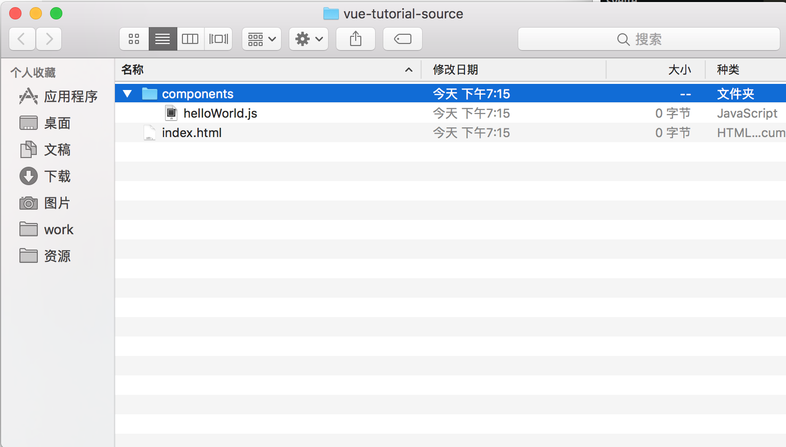

# 第一章 从零开始，完成一次发布

本书会向你详细的介绍使用 vue.js 开发 web 应用的方方面面，包括 html、css、less、vue、vuex、版本控制、github的使用等知识。学会这些知识将帮助你胜任 Vue 相关的开发工作，同时成为一名更好的 web 开发工程师。阅读本书能让你快速学会 vue 框架的基础，包括组件的编写、指令的开发、vue-router、vuex 的使用。读完本书之后，你已经可以独立搭建 vue 技术栈项目、编写自己的组件库、深入了解 vue 背后的知识。

> 脚手架: 更快、更简单、更诱人

Vue 以其小而美，易上手的特性，一推出就得到了众多开发者的喜爱。借助于 `vue-cli` 工具，我们更是可以在几分钟之内就搭建好一个完善的单页面应用框架，极大的提升开发的效率。
使用脚手架能够帮助我们快速、简单的开发应用，但是是使用脚手架生成的代码对于初学者来说过于复杂，虽然能学会使用脚手架进行开发，但是并不明白整个构建流程。所以本书会从零开始，带着你一步一步的开发一个类似于微博的应用程序，通过这个过程，让你能对 vue 有一个较为深刻的认识和理解，而且能灵活运用，开发任务其它类型的应用。

## 1.1 简介

Vue.js（读音 /vjuː/，类似于 view） 是一套构建用户界面的渐进式框架。与其他重量级框架不同的是，Vue 采用自底向上增量开发的设计。Vue 的核心库只关注视图层，它不仅易于上手，还便于与第三方库或既有项目整合。另一方面，当与单文件组件和 Vue 生态系统支持的库结合使用时，Vue 也完全能够为复杂的单页应用程序提供驱动。

### 预备知识

本书不仅介绍 Vue.js，还会涉及到路由、状态管理、构建工具、ajax等。所以在阅读本书之前建议先了解一些 web 编程的基础知识。如果你刚开始接触软件开发，建议你先了解编程方面的基础知识。

* 编程基础知识
	* [Learn Enough Command Line to Be Dangerous](http://www.learnenough.com/command-line-tutorial)
	* [Learn Enough Text Editor to Be Dangerous](http://www.learnenough.com/text-editor-tutorial)
	* [git 版本控制](http://www.liaoxuefeng.com/wiki/0013739516305929606dd18361248578c67b8067c8c017b000/)

* web 基础知识
	* [HTML/CSS](http://www.w3school.com.cn/h.asp)
	* [Javascript](http://www.liaoxuefeng.com/wiki/001434446689867b27157e896e74d51a89c25cc8b43bdb3000)
	* [ES6](http://es6.ruanyifeng.com)
	* [ajax](http://www.w3school.com.cn/ajax/ajax_intro.asp)

### 练习
书中有大量的练习，建议你在阅读的过程中做这些练习。

为了避免影响后续章节的学习，习题通常是章节独立的，只有少部分是会在后续的学习中用到，此时会给出解答说明。

练习都具有一定的难度，我们先从几个简单的开始：

1. vue 目前的版本号是多少？
2. 截止到目前，vue 在 github 上的 star 个数是多少？
3. 截止到目前，vue 被下载的次数?

<hr>

## 1.2 环境搭建

不同的操作系统、编辑器、集成开发环境、版本会导致开发环境的多样性，即使对于有经验的开发者来说，也会几经波折，所以如果你遇到什么问题可以给我们留言。本书中，我们将会使用 Mac 作为本次的开发硬件，如果你使用的是 windows 的电脑，也不用担心，安装对应的系统版本软件就可以。除此之外，如果你觉得搭建环境过于繁琐，可以使用云开发环境，这样可以免去不少麻烦。

云端集成开发环境推荐：

* [cloud9](https://c9.io/)
* [jsfiddle](https://jsfiddle.net)

不同的人有不同的喜好，每个开发者都有自己的开发环境，为了避免问题的复杂化，本书在此将推荐一个比较通用的开发环境，当然你也可以保持自己的习惯。

本书采用的开发环境：

* [编辑器 - sublime text3](http://www.sublimetext.com/3)
* [Nodejs(v6.9.4)](http://nodejs.cn)
* [包管理 - npm(yarn)](https://docs.npmjs.com)
* [构建工具 - webpack2.2](https://webpack.js.org/concepts/)
* [版本控制 - git](http://www.liaoxuefeng.com/wiki/0013739516305929606dd18361248578c67b8067c8c017b000/)
* [源码托管 - github](www.github.com)
* [代码校验 - esLint](http://eslint.cn)

如果一开始你不想安装如此多的软件也是可以的，即时不安装我们也可以进行应用的开发。但随着后续章节的学习你最好搭建这样的一套开发环境，这将会帮助你更好的进行开发。

## 1.3 第一个组件

在计算机编程领域里，第一个应用一般都是编写一个 "hello world" 程序。在这里，我们将编写一个显示 `hello world` 的组件。

### 创建项目

首先创建一个项目目录并命名为 `vue-tutorial-source`，这里我们使用 Unix 命令来创建，如果你不熟悉可以手动创建。但是作为一名开发者，我建议你学会基本的 Unix 命令。

```bash
mkdir vue-tutorial-source	// 新建项目根目录
cd vue-tutorial-source 		// 进入根目录
```

> Unix 命令
	使用 windows 系统的用户可能需要查看对应的 windows 命令行教程。这里主要对 Unix 命令行 -- Bash 进行说明。

	命令行的基本思想很简单: 使用简短的命令就可以做很多操作，例如创建目录(`mkdir`)，移动和复制文件 (`mv` 和 `cp`)，以及切换目录浏览文件。对于习惯了图形化界面的用户可能不习惯使用命令行，但是要了解，命令行是开发者强大的工具之一，经验丰富的开发者都比较熟悉以及更愿意使用命令行来工作。更有甚者，使用完全基于命令的编辑器，如 vim、emacs。

	命令行涉及很多的知识，但在本书中只使用了比较简单常用的一些命令，所以如果你不熟悉的话也不用担心。

### 一些常用的 Unix 命令
<table>
	<thead>
		<tr>
			<th>作用</th>
			<th>命令</th>
			<th>示例</th>
		</tr>
	</thead>
	<tbody>
		<tr>
			<td>列出当前目录下的文件</td>
			<td>ls</td>
			<td>ls -l</td>
		</tr>
		<tr>
			<td>新建目录</td>
			<td>`mkdir <dirname>`</td>
			<td>mkdir new-dir</td>
		</tr>
		<tr>
			<td>切换目录</td>
			<td>`cd <dirname>`</td>
			<td>ls -l</td>
		</tr>
		<tr>
			<td>进入上级目录</td>
			<td></td>
			<td>cd ..</td>
		</tr>
		<tr>
			<td>删除文件</td>
			<td>`rm <file>`</td>
			<td>rm foo</td>
		</tr>
	</tbody>
</table>

接下来创建 `components` 目录存放组件文件，并在 `components`目录下创建 `helloWorld.js` 文件，同时创建 `index.html` 文件作为我们应用的入口。

命令行操作

```base
touch index.html
mkdir components
cd components
touch helloWorld.js
```
如果你不习惯命令行，使用图形界面来创建也是一样的。


### 引入 Vue.js

创建好目录结构后，就可以正式开发编码了，在开始之前，我们需要注意如下问题：

* vue 的版本
	软件都是有版本的概念的，不同的版本功能会有不同，大的版本还会有兼容性问题，所以我们要确定好使用的版本。本书我们使用 vue 2.2 版本作为实例讲解。
* vue 的引入方式
	这里我们先简单的通过 CDN 的方式引入 vue.js，后续我们会通过 npm 包管理工具以模块的方式引入 vue。
* 编码规范问题
	无论对于初学者或是有经验的开发者，编码规范都是很有必要且很有帮助的。这里我们参考 [vue 组件编码规范](https://github.com/pablohpsilva/vuejs-component-style-guide/blob/master/README-CN.md#目录)。


