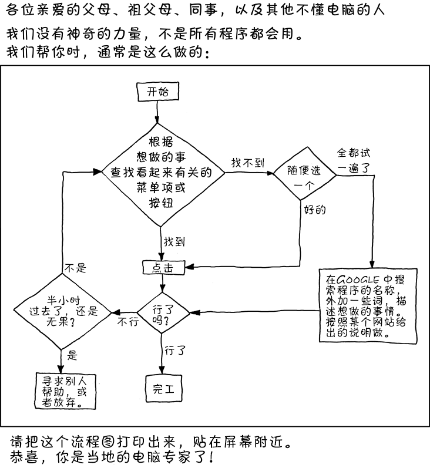

## 第一章 从零开始，完成一次发布

本书会向你详细的介绍使用 vue.js 开发 web 应用的方方面面，包括 html、css、less、vue、vuex、版本控制、github的使用等知识。学会这些知识将帮助你胜任 Vue 相关的开发工作，同时成为一名更好的 web 开发工程师。阅读本书能让你快速学会 vue 框架的基础，包括组件的编写、指令的开发、vue-router、vuex 的使用。读完本书之后，你已经可以独立搭建 vue 技术栈项目、编写自己的组件库、深入了解 vue 背后的知识。

> 脚手架: 更快、更简单、更诱人

Vue 以其小而美，易上手的特性，一推出就得到了众多开发者的喜爱。借助于 `vue-cli` 工具，我们更是可以在几分钟之内就搭建好一个完善的单页面应用框架，极大的提升开发的效率。
使用脚手架能够帮助我们快速、简单的开发应用，但是是使用脚手架生成的代码对于初学者来说过于复杂，虽然能学会使用脚手架进行开发，但是并不明白整个构建流程。所以本书会从零开始，带着你一步一步的开发一个类似于微博的应用程序，通过这个过程，让你能对 vue 有一个较为深刻的认识和理解，而且能灵活运用，开发任务其它类型的应用。

### 1.1 简介
